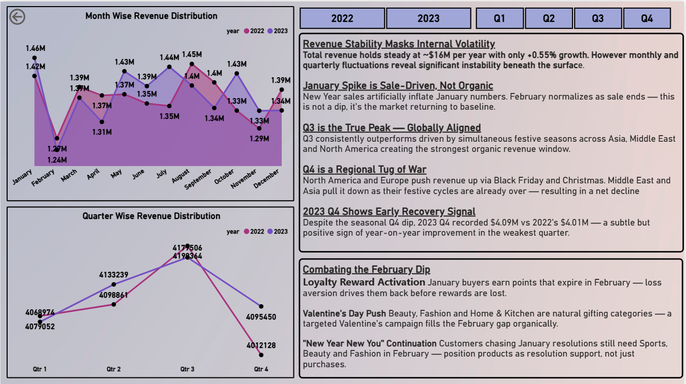
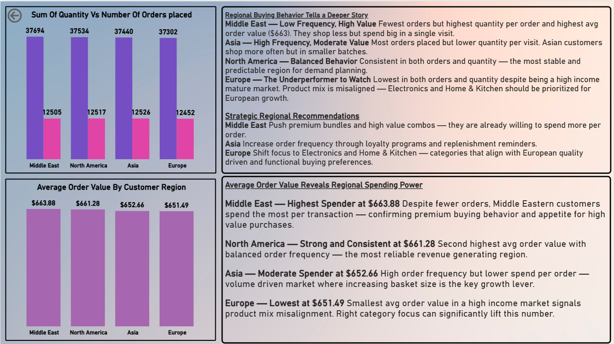

# 📦 Amazon Sales Analysis — MySQL + Power BI

> Uncovering what $32.87M in revenue was actually hiding.

---

## 🧭 Project Overview

This is an end-to-end data analysis project built on 50,000 Amazon orders
spanning 2 years, 4 regions and 6 product categories.

The goal was not just to visualize the data — but to find the story the 
surface numbers were hiding and translate it into actionable business 
recommendations.

**Tools Used:** MySQL · Power BI · DAX

---

## 📸 Dashboard Preview

### Main Overview


### Revenue Trends


### Regional Intelligence


### Category Deep Dive


### Executive Summary


---

## 📁 Repository Structure
```
amazon-sales-analysis/
│
├── Main Dashboard.png          # Main overview page
├── trend.png                   # Revenue trends page
├── frequency.png               # Regional intelligence page
├── product likeness.png        # Category deep dive page
├── all insight.png             # Executive summary page
├── pdf view.pdf                # Complete dashboard — read only
├── amazon.sql                  # Full SQL script
└── README.md
```

---

## 📊 Dataset Overview

| Column | Description |
|---|---|
| order_id | Unique order identifier |
| order_date | Date of transaction |
| product_id | Unique product identifier |
| product_category | Category of product |
| price | Original price |
| discount_percent | Discount applied |
| quantity_sold | Units sold per order |
| customer_region | Region of customer |
| payment_method | Mode of payment |
| rating | Customer rating |
| review_count | Number of reviews |
| discounted_price | Price after discount |
| total_revenue | Final revenue per order |

---

## 🛠️ SQL Workflow

### Step 1 — Data Validation
- Null checks across all 13 columns
- Duplicate check on order_id
- Trim checks on all categorical columns
- Formula verification for discounted_price and total_revenue

**Result — Zero nulls. Zero duplicates. Zero trailing spaces.**

### Step 2 — Time Intelligence Engineering
Raw data had only order_date. Engineered:
- `quarter` column using QUARTER()
- `monthname` column using MONTHNAME()
- `year` column using YEAR()
- `DimMonth` reference table for clean joins

### Step 3 — Revenue Analysis
- Year on year growth using LEAD() window function
- Monthly trend comparison using CTE + LEAD()
- Quarterly breakdown for both years

### Step 4 — Regional Analysis
- Avg order value per region
- Order count per region
- Quantity sold per region
- Approx revenue per region

### Step 5 — Category Analysis
- Revenue per category
- Quantity per category
- Revenue to quantity ratio — the key metric that
  revealed the Beauty vs Fashion story

---

## 🔍 Key Findings

### 1. Flat Growth Hides Internal Volatility
$32.87M looks stable. +0.55% YoY growth looks acceptable.
But monthly and quarterly swings reveal significant instability
beneath the surface. The total number was lying.

### 2. January is the Outlier — Not February
February dip is visible every year. Everyone flags it as a problem.
It is not. January is artificially inflated by New Year sales.
February is just the market returning to baseline.

### 3. Q3 is the True Peak — Globally Aligned
Q3 outperforms every quarter — not because of summer shopping —
but because every region hits its festive calendar simultaneously.

| Region | Q3 Events |
|---|---|
| Asia | Raksha Bandhan, Ganesh Chaturthi, Mid-Autumn |
| Middle East | Eid al-Adha |
| North America | Back to School, Labor Day |
| Europe | Oktoberfest, Summer travel |

### 4. Q4 is a Regional Tug of War
North America and Europe push Q4 UP — Black Friday, Christmas.
Middle East and Asia pull Q4 DOWN — festive cycle already over.
Net result — decline. But 2023 Q4 ($4.09M) > 2022 Q4 ($4.01M).
The tug of war is slowly tilting.

### 5. The $12 Gap Worth $153,000

| Region | Avg Order Value |
|---|---|
| Middle East | $663.88 |
| North America | $661.28 |
| Asia | $652.66 |
| Europe | $651.49 |

Europe is the lowest despite being a high income market.
Not a pricing problem — a product mix problem.
Closing the $12 gap across 12,452 European orders = $153,000
in additional revenue without a single new customer.

### 6. Fashion vs Beauty — Volume vs Value

| Category | Orders | Revenue |
|---|---|---|
| Fashion | 8.6K | $5.480M |
| Beauty | 8.5K | $5.551M |

Fashion wins volume. Beauty wins value.
Every Beauty customer is worth more per transaction.

---

## 🎯 Strategic Recommendations

| Area | Recommendation |
|---|---|
| Q3 | Premium bundles and festive packs. No discounts. Protect margin. |
| February | Loyalty reward expiry + Valentine's + New Year New You campaigns |
| Europe | Shift focus to Electronics and Home & Kitchen |
| Middle East | Push high value combos and premium offerings |
| Asia | Loyalty programs to increase order frequency |

---

## 📊 Dashboard Structure

| Page | File | Purpose |
|---|---|---|
| Executive Summary | all insight.png | Conclusions first |
| Main Overview | Main Dashboard.png | KPIs and full overview |
| Revenue Trends | trend.png | Monthly and quarterly patterns |
| Regional Intelligence | frequency.png | Buying behavior by region |
| Category Deep Dive | product likeness.png | Revenue by category and region |

---

## 💡 The One Thing I Learned

> *Never trust the total. Always go one level deeper.*

$32.87M told me almost nothing.
The 50,000 orders underneath it told me everything.

---

## 📄 Full Dashboard

Complete 5 page dashboard available as PDF — [pdf view.pdf](pdf%20view.pdf)

---

## 📬 Connect

**LinkedIn** — [Your LinkedIn URL]
**Article** — [Your LinkedIn Article URL]

---

⭐ If this project helped you — drop a star on the repo!
